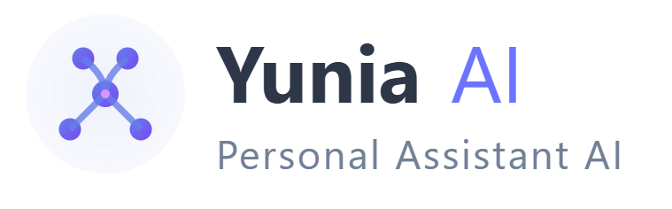

# Yunia AI – Personal Assistant Dashboard

<div align="center">

   <p align="center">
  
</p>
  <h3>✨ "Hi, I'm Yunia — your personal AI assistant." ✨</h3>

  <div align="center">
    
    
    
    
  </div>

  <br />

  <a href="#-overview">Overview</a> •
  <a href="#-features">Features</a> •
  <a href="#-tech-stack">Tech Stack</a> •
  <a href="#-setup">Setup</a> •
  <a href="#-documentation">Documentation</a>
</div>

<br />

---

## 🎯 Project Overview

**Domain: Personal AI Assistant SaaS Platform**

I built Yunia AI as my frontend bootcamp project - it's basically a personal assistant dashboard where users can chat with AI, track their habits, manage subscriptions, and organize their daily stuff. Think of it like having your own digital assistant that remembers your conversations and helps you stay productive.

The whole idea came from wanting to create something that feels like a real SaaS product you'd actually pay for, not just another todo app. So I added proper user authentication, subscription plans with Stripe, and even admin features.

**What makes this different:**
- Actually works with real AI (Google Gemini API)
- Has voice chat - you can literally talk to it
- Remembers your conversations and learns from them
- Proper subscription system with usage limits
- Clean, responsive design that doesn't look like a student project
- Role-based access (regular users vs admins)

This was built for the **Adnexio Full-Stack Bootcamp** as my frontend capstone project. I wanted to show I could build something commercial-grade, not just follow tutorials.

---

## ✨ What I Built

### Core Features That Actually Work

**🤖 AI Chat Interface**
- Real conversations with Google Gemini AI
- Voice input/output using Web Speech API
- Conversation history that persists
- Smart memory management with duplicate detection

**👤 User Authentication & Roles**
- Separate login for users and admins
- Protected routes based on user roles
- Profile management with avatar uploads
- Secure logout with confirmation

**💳 Subscription System**
- Three tiers: Free, Pro, Business
- Real Stripe integration (test mode)
- Usage monitoring and limits
- Subscription cancellation handling

**📊 Memory & Analytics**
- Conversation categorization and filtering
- Polar charts showing AI learning data
- Smart duplicate conversation cleanup
- Data retention management

**🎯 Productivity Tools**
- Habit tracking system
- Reminder management
- Daily briefings
- Task organization

**📱 User Experience**
- Fully responsive design (mobile + desktop)
- Collapsible sidebar with tooltips
- DaisyUI components for consistency
- Loading states and error handling

---

## 🛠 Tech Stack

**Frontend Framework**
- React 18.3 with functional components and hooks
- Vite 6.3 for fast development and building
- React Router DOM for navigation

**Styling & UI**
- Tailwind CSS 3.4 for utility-first styling
- DaisyUI 5.0 for pre-built components
- Responsive design for mobile and desktop

**APIs & Integrations**
- Google Gemini AI for chat functionality
- Stripe for payment processing
- Web Speech API for voice input/output
- Fetch API for data handling

**State Management**
- React hooks (useState, useEffect, useContext)
- Local storage for data persistence
- Custom hooks for reusable logic

**Development Tools**
- ESLint for code quality
- PostCSS for CSS processing
- Chart.js for data visualization

**Data Storage**
- JSON files for mock API data
- Local storage for user preferences
- Session storage for temporary data

---

## � Getting Started

### Prerequisites
- Node.js 18+ installed
- Git for cloning the repository
- A modern web browser

### Installation

1. **Clone the repository**
```bash
git clone https://github.com/azizizaidi/yunia-ai.git
cd yunia-ai
```

2. **Install dependencies**
```bash
npm install
```

3. **Set up environment variables** (optional)
```bash
# Create .env file for API keys (if you want real AI functionality)
VITE_GEMINI_API_KEY=your_gemini_api_key_here
VITE_STRIPE_PUBLISHABLE_KEY=your_stripe_key_here
```

4. **Start the development server**
```bash
npm run dev
```

5. **Open your browser**
Navigate to `http://localhost:5173`

### Test Accounts
- **User**: email: `ina@gmail.com`, password: `ina123`
- **Admin**: email: `azizizaidi5@gmail.com`, password: `admin123`

### Building for Production
```bash
npm run build
npm run preview
```

---

## 📁 Project Structure

<div align="center">
  
</div>

```
yunia-ai/
├── docs/ # 📚 Documentation files
│   ├── flowchart.drawio # System flow diagram
│   ├── wireframe.png # UI layout plan
│   ├── module-list.md # Feature list & scope
│   ├── pseudocode.md # Logic plan before coding
│   ├── api-plan.md # API endpoint reference
│   └── dev-notes.md # Daily notes & progress
│
├── public/ # 🔓 HTML & static assets
│   └── index.html
│
├── src/ # 💻 React frontend
│   ├── assets/ # Icons, images, audio
│   ├── components/ # UI modules (ChatBox, HabitList, etc.)
│   ├── pages/ # Route-based views (Dashboard, Plan)
│   ├── layout/ # Sidebar, Header, layout shell
│   ├── services/ # API logic (weather, traffic, calendar)
│   ├── hooks/ # Custom hooks (useAuth, useTTS, etc.)
│   ├── context/ # Global context (AuthContext, AssistantContext)
│   ├── utils/ # Prompt builders, helpers
│   ├── styles/ # Tailwind & global styles
│   ├── App.jsx # App root
│   └── main.jsx # Entry point
│
├── .env # 🔒 Environment variables (API keys, not in Git)
├── .env.example # 📝 Example environment variables template
├── db.json # 🔧 Mock data for development
├── vercel.json # ⚙️ Deployment configuration
├── README.md # 📘 This file
├── .gitignore # Git ignore rules
├── package.json # Project metadata & dependencies
├── vite.config.js # Vite bundler config
└── tailwind.config.js # Tailwind setup
```

---

## 📄 Documentation

<div align="center">
  
  <br />
  <strong>All documentation is stored in the `/docs` folder:</strong>
</div>

<div align="center">
  <table>
    <tr>
      <td align="center">
        
        <br /><strong>flowchart.drawio</strong>
        <br />System flow
      </td>
      <td align="center">
        
        <br /><strong>wireframe.png</strong>
        <br />Screen layout plan
      </td>
      <td align="center">
        
        <br /><strong>module-list.md</strong>
        <br />Frontend modules to build
      </td>
    </tr>
    <tr>
      <td align="center">
        
        <br /><strong>pseudocode.md</strong>
        <br />Feature logic design
      </td>
      <td align="center">
        
        <br /><strong>api-plan.md</strong>
        <br />Mock + real API endpoints
      </td>
      <td align="center">
        
        <br /><strong>api-setup.md</strong>
        <br />API keys setup guide
      </td>
    </tr>
    <tr>
      <td align="center">
        
        <br /><strong>dev-notes.md</strong>
        <br />Developer progress log
      </td>
      <td align="center"></td>
      <td align="center"></td>
    </tr>
  </table>
</div>

---

## 📅 Development Timeline

<div align="center">
  
</div>

| Day | Focus | Progress |
|-----|-------|----------|
| **1–2** | Planning: flowchart, wireframe, pseudocode | 📋 |
| **3–6** | Auth, Layout, Chat, Voice | 🔐 |
| **7–10** | Habit, Reminder, Weather, Memory | 📝 |
| **11–12** | Traffic, Google Calendar, Plan | 🚗 |
| **13** | Autopilot AI Briefing | 🤖 |
| **14** | UI Polish, Deployment, Final Docs | 🚀 |

---

## 📢 Acknowledgement

<div align="center">
  
  <br />
  <strong>This project is built as part of the</strong>
  <br />
  <strong>Adnexio Full-Stack Bootcamp (Frontend Phase – May 2025)</strong>
  <br />
  <em>by Muhammad Azizi bin Zaidi</em>
</div>

---

## 🌐 Live Demo

<div align="center">
  
  <br />
  <strong>**Coming Soon:** Will be deployed to Vercel</strong>
</div>

---

<div align="center">
  <sub>Made with ❤️ by Muhammad Azizi bin Zaidi</sub>
  <br />
  <sub>© 2025 Yunia AI. All rights reserved.</sub>
</div>
